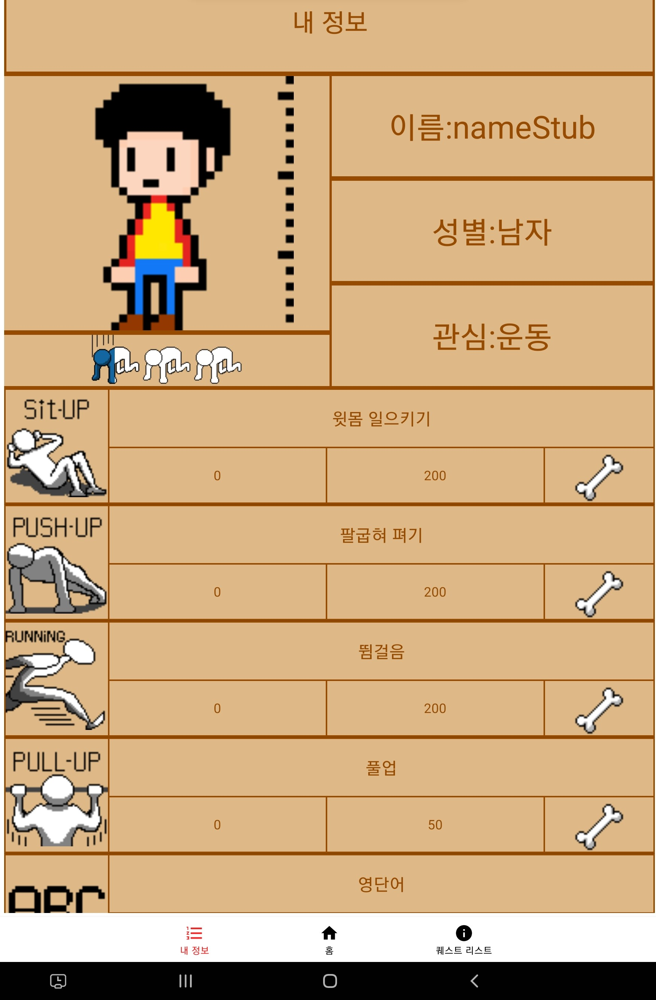
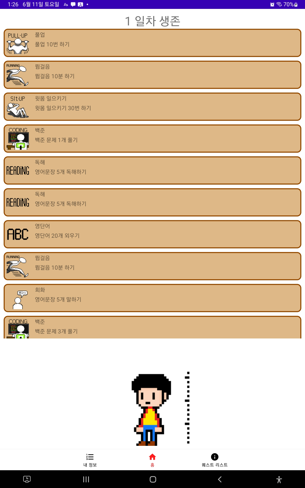

Capstone
===

> ✨ 이문서는 2022년도 4학년 1학기에 진행하는 캡스톤디자인 활동에 대해 기록하는 문서 입니다.

👨‍👨‍👧‍👦Contributor
---
|역할|이름|학번|업무|
|--|--|--|--|
|팀장|서순원|20174489| Frontend ,UI😃 |
|팀원|조윤혁|20174434| Architecture , Class Design✨ |
|팀원|최수한|20174414| Art Work🎨 |
|팀원|김희재|20174257| Frontend , UI😃 |
|팀원|고지민|20174222| Data handling, Algorithm💡 |

## ✍️Index

> 1. 안드로이드 앱 개발 [App](https://verdant-result-e1b.notion.site/83b388037b7343be88a792b7d06983fe) **작심삼백일**
> 2. [Skill](#Skill)
----
## 1. 📱 App(작심삼백일)

> 
> [App](https://excessive-onyx-7ef.notion.site/22-03-24-444d531edf074ab69d0f0b42092ef977) < 설명은 링크로 대체

    
    

## 2. 📖Skill

> * Kotlin
> * Android Studio
> * git (github)
> * kakao oven, figma (prototype)
> 